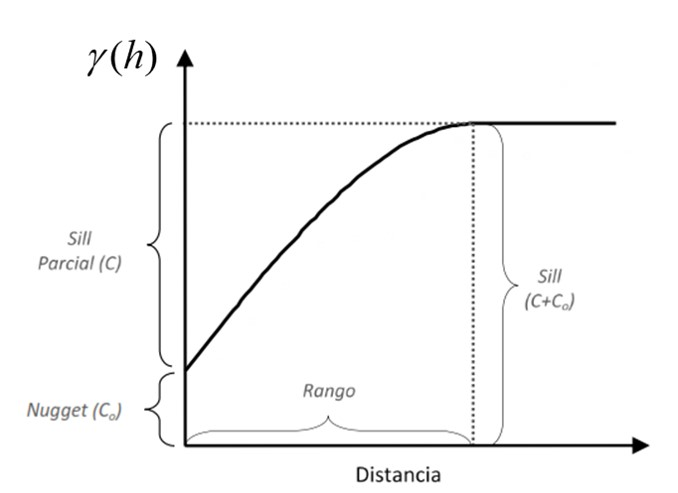
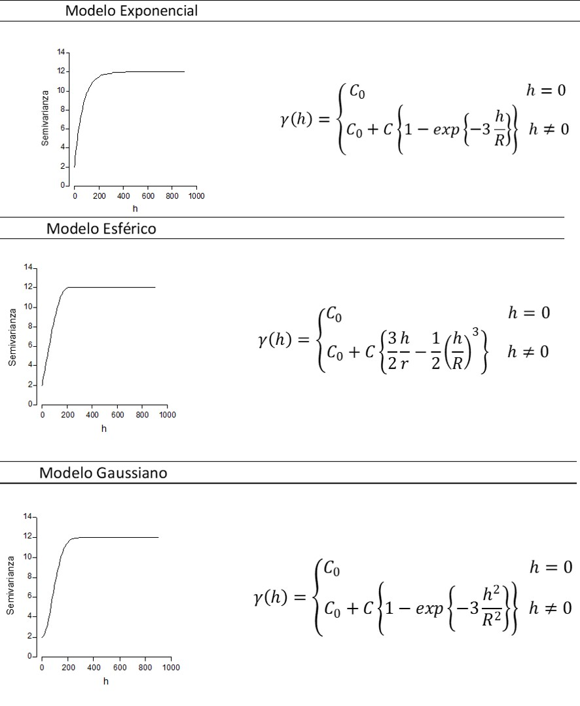

```{r setup, include=FALSE}
knitr::opts_chunk$set(echo = FALSE)
```

## Módulo 1: 

- Introducción a la Geoestadística.

- Semivariogramas. 

- Interpolación Kriging.

- Ejemplos de aplicación.

## Módulo 2: 

- Algoritmos de Aprendizaje Automático.

- Random Forest.

- Ajuste y validación de modelos predictivos.

- Incorporación de la información espacial: Random Forest Kriging.

- Ejemplos de aplicación.


## Estadística Clásica vs. Geoestadística 

- Estadística Clásica

Considera los datos como realizaciones independientes de una misma variable aleatoria (VA) (siguen la misma distribución)

Se busca estimar los parámetros de esta distribución

- Geoestadística

Cuando los datos están ubicados en el espacio geográfico estas hipótesis son raramente aceptables
     
Observaciones próximas en el espacio tienen valores “parecidos”, mientras que aquellas que están más alejadas entre sí tienen una menor relación

## Variable Regionalizada

Un conjunto de valores de una variable aleatoria constituyen una función aleatoria o proceso estocástico. 

La realización de una función aleatoria se conoce como variables regionalizadas

El fenómeno regionalizado se extienden en el espacio 
y presenta una cierta continuidad

Las variables regionalizadas miden propiedades o atributos relacionados con la variación 
del mismo en el espacio

## Algunos ejemplos

Porosidad de la roca en un reservorio de petróleo o en un acuífero

Concentración de un elemento contaminante en la atmósfera o en el suelo

La elevación en un punto del espacio geográfico

El pH y la concentración en nutrientes medidas sobre una muestra de suelo

El número de árboles y su diámetro promedio en áreas de observación de un bosque

```{r, echo = FALSE, message=FALSE}
#install.packages (c("caret","gstat","geoR", "spdep", "mapview", "raster","leaflet"
#                    ,"RColorBrewer", "e1071", "leaflet", "PerformanceAnalytics", "ggplot2"))

library(gstat) #
library(geoR) #
library(mapview) #
library(raster) #
library(leaflet) #
library(RColorBrewer) #
library(PerformanceAnalytics) #
library(ggplot2) #
library(caret) #
library(parallel) #

```

## Valor unitario de la tierra
```{r, echo = TRUE, fig.height=3}
# Carga de base de datos
datos <- read.table("datosSF_depurados.txt", header = T)
# Gráficos Exploratorios
chart.Correlation(datos[,1:9], histogram=TRUE, pch=19)
chart.Correlation(datos[,c(1,9:18)], histogram=TRUE, pch=19)
```

## Tendencia respecto a coordenadas
```{r, echo = TRUE}  
plot(datos$x, datos$VUT)
plot(datos$y, datos$VUT)
```

## Distribución de VUT
```{r, echo = TRUE}
hist(datos$VUT)
skewness(datos$VUT)  
```

## Visualización en el plano
```{r, echo = TRUE, fig.height=4}
#Transformación a objeto espacial
coordinates(datos) <- c("x", "y")
crs(datos) <- CRS("+init=epsg:22174")
# Visualización
spplot(datos["VUT"],col.regions=terrain.colors(20))
```

## Visualización en el plano
```{r, echo = TRUE, fig.height=4}
cols <-colorRampPalette(rev(brewer.pal(11, "Spectral")))#Genero una paleta
mapview(datos, zcol="VUT",alpha=0, col.regions =cols)#Visualización interactiva 
```

## Proceso Aleatorio

Estos procesos están físicamente determinados, pero sus interacciones son tan complejas que la variación parece ser aleatoria 

Dada la complejidad de la interacción, una solución determinística puede distorsionar la inferencia estadística

La solución propuesta por Matheron (1965) fue tratar la variación como si fuera aleatoria

## Estacionariedad

La noción de estacionariedad sostiene la geoestadística y nos permite asumir que existe el mismo grado de variación de un lugar a otro. 

El proceso aleatorio puede ser representado por el modelo 
$$Z(x)=µ + ε(x)$$

donde $\mu$ es la media del proceso y $ε(x)$ es una cantidad aleatoria con una media de cero y una covarianza, $C(h)$, dada por

$$C(h)= E[ε(x) + ε (x+h)]$$

$$C(h)= E[(Z(x) -µ) (Z(x+h) - \mu) ]= E[Z(x) Z(x+h) - \mu^2]$$

## Estacionariedad

Si la media no es contaste, entonces la covarianza no puede existir

En ese caso invocamos la hipótesis de estacionariedad débil o intrinseca
propuesta por Materon en la que las diferencias esperadas son cero,

$$E[Z(x)-Z(x+h)]=0$$

La co-varianza se sustituye por la mitad de las diferencias, la semivarianza:

$$\gamma(h)={\frac{1}{2}}var[Z(x)-Z(x+h)]={\frac{1}{2}}E[(Z(x)-Z(x+h))^2]$$

Al igual que la covarianza, la semivarianza depende de $h$ y sólo de $h$, 
y como la función de $h$ es el variograma $\gamma(h)$

## Estacionariedad 

Un proceso estacionario a una escala podría, a otra escala, mostrar tendencia, 
es decir, un componente sistemático

el modelo para esa escala sería:

$$Z(x)=\mu(x)+e(x)$$

En la que $\mu(x)$ es un término de tendencia determinista que sustituye a la media constante $\mu$

El variograma es calculado a partir de los residuos

$$\gamma(h)={\frac{1}{2}}E[(e(x)-e(x+h))^2]$$

## Semivarianza

Función básica que describe la variabilidad espacial de un fenómeno

Responde a la siguiente pregunta: 

¿Cómo de parecidos son los puntos en el espacio a 
medida que estos se encuentran más alejados?

Mientras más similares sean las observaciones, menor la semivarianza

## Semivarianza
$$\gamma^*(h)={\frac{1}{2N(h)}}\sum_{i=1}^{n}\big[(E(x)-E(x+h))^2\big]$$

$\gamma(h)$ es el valor experimental de la semivarianza de datos separados por una distancia $h$
$N$ es el número de pares de puntos de muestreo separados por la distancia $h$

$Z(x_i)$ es el valor de la variable $Z$ en el punto muestreado $x_i$

$Z(x_i + h)$ es el valor de la propiedad $Z$ en el punto muestreado a una distancia $x_i + h$

## Semivariograma experimental

El semivariograma es generalmente una función incremental. 
A distancias crecientes entre 2 puntos la varianza de su diferencia tiende a aumentar.

Se definen "ventanas" en torno a una unidad de muestreo a los fines de encontrar los puntos pares correspondientes a distancias y direcciones determinadas.

```{r, fig.height=4, echo = TRUE}
# Ajuste de semivariograma experimetal
semi_exp <- variogram(VUT~1, datos)
plot(semi_exp)
```

## Semivariograma Teórico

Algunos de los modelos teóricos más usados para modelar semivariogramas asumen tendencias lineales cerca del origen (modelos exponenciales y esféricos) mientras que otros involucran un efecto cuadrático cerca del origen (modelo gaussiano). 

Un incremento lento del semivariograma cerca del origen sugiere la presencia de un patrón de estructura espacial consistente. 

Para un mismo rango y umbral, el semivariograma exponencial crece más rápidamente que el gaussiano, sugiriendo menor estructura espacial. 

```{r, echo=FALSE, out.width=4}

```

```{r, echo=FALSE, out.width=4}

```

## Ajuste de Semivariogramas
Modelo exponencial

```{r, fig.height=4, echo = TRUE}
# Ajuste de semivariograma teórico, modelo exponencial
mod_exp <- fit.variogram(semi_exp, vgm(3000000, "Exp", 1500, 10000))
mod_exp
plot(semi_exp , mod_exp)
```

## Ajuste de Semivariogramas 
Modleo esférico
```{r,fig.height=4,echo = TRUE}
# Ajuste de semivariograma teórico, modelo esférico
mod_esf = fit.variogram(semi_exp, vgm(3000000, "Sph", 1500, 10000))
mod_esf
plot(semi_exp , mod_esf)
```

## Visualización conjunta
```{r, echo = TRUE}
vgLine <- rbind(cbind(variogramLine(mod_exp, maxdist = max(semi_exp$dist)), id ="Exponencial"),
  cbind(variogramLine(mod_esf, maxdist = max(semi_exp$dist)), id ="Esférico")
  )
grafico <-  ggplot(semi_exp, aes(x = dist, y = gamma, color = id)) +
  geom_line(data = vgLine) + 
  geom_point() +
  labs(title ="Semivariograma experimental y teórico ajustado")  +
  xlab("Distancia") + 
  ylab("Semivarianza")  + 
  scale_color_discrete(name = "Modelo", labels = c("Esférico", "Exponencial", "Experimental"))
grafico
```

## Evaluación y ajuste automático
```{r}
# Suma de cuadrado del error de modelos ajustados
attr(mod_exp, 'SSErr')
attr(mod_esf, 'SSErr')
# Ajuste automatico de modelos
v.fit_todos <- fit.variogram(semi_exp,vgm(c("Exp", "Sph", "Gau")))
plot(semi_exp,v.fit_todos)
attr(v.fit_todos, 'SSErr')
```

## Interpolación espacial 

- No geoestadísticas

Poligonos de Thiessen (Voronoi)

Triangulación

Inverso de la distancia (IDW)

Regresión polinómica...

- Geoestadísticas

Kriging

## Interpolación Kriging 

El kriging es una técnica de estimación que proporciona el mejor estimador lineal insesgado (BLUE, Best Linear Unbiased Estimator)

Proporciona un error de estimación conocido como varianza de kriging que depende del modelo de semivariograma obtenido y de las localizaciones de los datos originales 

Esto permite hacer un análisis sobre la calidad de las estimaciones

El método kriging realiza una ponderación, i.e. atribuir un peso a cada valor observado 

Los pesos son calculados de manera que minimice la varianza de estimación resultante, teniendo en cuenta la característica espacial de los datos 

Al minimizar la varianza de estimación se garantiza el uso óptimo de la información disponible

## Interpolación Kriging 
Supongamos que los valores de la variable aleatoria $Z$, han sido muestreados en los puntos $x_1,x_2,...,x_n$ 

para $N$ datos $z(x_i)$, $i=1,2,3,...,N$ y se quiere predecir $Z$ en cualquier punto $x_0$, mediante:
$$\hat Z(x_0)\sum_{i=1}^{N}\lambda_{i} z(x_i)$$
Donde $\lambda$ son los pesos asignados para la ponderación 

## Interpolación Kriging 

Para asegurar que la estimación sea insesgada los pesos son dados de manera que:

$$\sum_{i=1}^{N}\lambda_{i}=1$$
$$E[\hat Z(x_0)-z(x_0))]=0$$

Siendo además un estimador de varianza mínima:

$$var[\hat Z(x_0)]=E[(\hat Z(x_0)-z(x_0))^2]= \sum_{i=1}^{N}\lambda_{i}\gamma(x_i-x_0)-\sum_{i=1}^{N}\sum_{j=1}^{N}\lambda_{i}\lambda_{j}\gamma(x_i-x_0)$$

## Grilla de predicción regular
```{r, echo = TRUE}
Limites <- read.table("bordesSF.txt",header = T)
gr <- pred_grid(Limites, by=100) ;  plot(gr)
```

## Grilla de predicción regular
```{r, echo = TRUE}
gri <- polygrid(gr,bor=Limites)
#plot(gri)
names(gri)[1]<-paste("x")
names(gri)[2]<-paste("y")
gridded(gri) = ~x+y
plot(gri)
crs(gri) <- CRS("+init=epsg:22174")
```

## Grilla de predicción por ejes de manzana
```{r, echo = TRUE}
ejes <- read.table("ejesSF.txt", dec = ",",header = T)
names(ejes)
names(ejes)[names(ejes) =="g_perc_edif"] <- "g_porc_edi"
names(ejes)[names(ejes) =="g_perc_baldio"] <- "g_por_bald"
names(datos)
coordinates(ejes) = ~x+y
crs(ejes) <- CRS("+init=epsg:22174")
plot(ejes)
```

## Grilla de predicción por ejes de manzana
```{r, echo = TRUE}
mapview(ejes)
```

## Kriging 
- Tipos

Simple ->  variable estacionaria de media conocida

Ordinario -> variable estacionaria de media desconocida

Universal

Co-Kriging

Regression Kriging

Kriging con deriva externa

## Kriging

Si el número de variables auxiliares es bajo y no están disponibles en todos los nodos de la grilla, se debe usar co-kriging

Si se dispone de información auxiliar en todos los nodos de la grilla y se correlaciona con la variable objetivo, se debe usar  kriging con un modelo de tendencias, también llamado "deriva externa“.

  - Kriging universal: se produce un cambio de la media cuando la tendencia se modela en función de coordenadas. 
  - Kriging con deriva externa:  la deriva se define externamente a través de alguna variable auxiliar

## Kriging en la grilla
```{r, echo = TRUE }
# Kriging Ordinario
kriging_grilla <- krige(VUT~1, datos, gri, model = v.fit_todos)
spplot(kriging_grilla["var1.pred"], main = "Kriging Ordinario: Predicciones", col.regions=terrain.colors(20))
```

## Kriging en la grilla
```{r, echo = TRUE}
## Kriging en la grilla
spplot(kriging_grilla["var1.var"],  main = "Kriging Ordinario: Varianza", col.regions=terrain.colors(20))
```

## Kriging en los ejes de manzana 
```{r, echo = TRUE }
kriging_ejes <- krige(VUT~1, datos, ejes, model = v.fit_todos)
spplot(kriging_ejes["var1.pred"], main = "Kriging Ordinario: Predicciones", col.regions=terrain.colors(20))
```

## Kriging en los ejes de manzana 
```{r, echo = TRUE}
spplot(kriging_ejes["var1.var"],  main = "Kriging Ordinario: Varianza", col.regions=terrain.colors(20))
```

## Vemos todo junto!!
```{r, echo = TRUE }
# EXtracción de predichos Y varianza de predicción
pred <- kriging_grilla$var1.pred
varpred <-kriging_grilla$var1.var
cord_X <- kriging_grilla$x
cord_Y <- kriging_grilla$y
tablapred <- cbind(cord_X,cord_Y,pred, varpred)
# Visualización interactiva
cols <-colorRampPalette(rev(brewer.pal(11, "Spectral"))) # Genero una paleta
muestra <- mapview(datos,zcol = "VUT", ceX ="VUT", layer.name ="Muestra", col.regions = cols, alpha=0) 
pred_grilla <- rasterFromXYZ(tablapred[,1:3])
crs(pred_grilla) <-CRS("+init=epsg:22174")

mapapred_grilla <- mapview(pred_grilla,legend=T, col.regions =  cols, layer.name ="Predichos Grilla",na.color = "transparent") 

var_grilla <- rasterFromXYZ(tablapred[,c(1,2,4)])
crs(var_grilla) <-CRS("+init=epsg:22174")

mapavar_grilla <- mapview(var_grilla,legend=T, col.regions =  cols, layer.name ="Varianza Predicci?n Grilla",na.color = "transparent") 

crs(kriging_ejes) <-CRS("+init=epsg:22174")
mapapred_ejes <- mapview(kriging_ejes, zcol = "var1.pred", ceX ="var1.pred",col.regions =  cols, layer.name ="Predicho Ejes", alpha=0) 

mapavar_ejes <- mapview(kriging_ejes, zcol = "var1.var", ceX ="var1.var",col.regions =  cols, layer.name ="Varianza Predicci?n Ejes", alpha=0)

muestra +  mapapred_grilla + mapavar_grilla + mapapred_ejes + mapavar_ejes
```

## Otras opciones de visualización
```{r, echo = TRUE }
muestra_predichos <- muestra +  mapapred_ejes

muestra_predichos %>% 
  leafem::addLogo ("https://idecor.cba.gov.ar/wp-content/uploads/2017/07/cropped-logo-IDECOR.png",position = "topleft" , width = 180, height = 60) %>%
  leafem::addHomeButton(extent(pred_grilla), "Ciudad de San Francisco" , position = "bottomright") %>%
  addMiniMap(position = "bottomleft" , width = 150, height = 150) 
```

## Otras opciones de visualización
```{r, echo = TRUE}
muestra_predichos %>%   
  leafem::addLogo("https://media.giphy.com/media/7JyrFBoAqrFOYVWXLK/giphy.gif",
                  position = "topleft",offset.x = 5, offset.y = 100, width = 200, height = 200) %>%
  # leafem::addHomeButton(ext = extent(r), "Ciudad de San Francisco" , position = "bottomright") %>%
  addMiniMap(position = "bottomleft" , width = 100, height = 100)
```

## Muchas gracias

Nos vemos mañana :)

```{r, purl=FALSE}
knitr::include_graphics("https://media.giphy.com/media/11Lz1Y4n1f2j96/giphy.gif")
```
