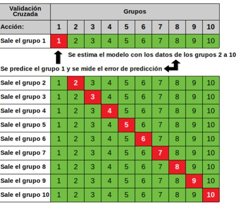
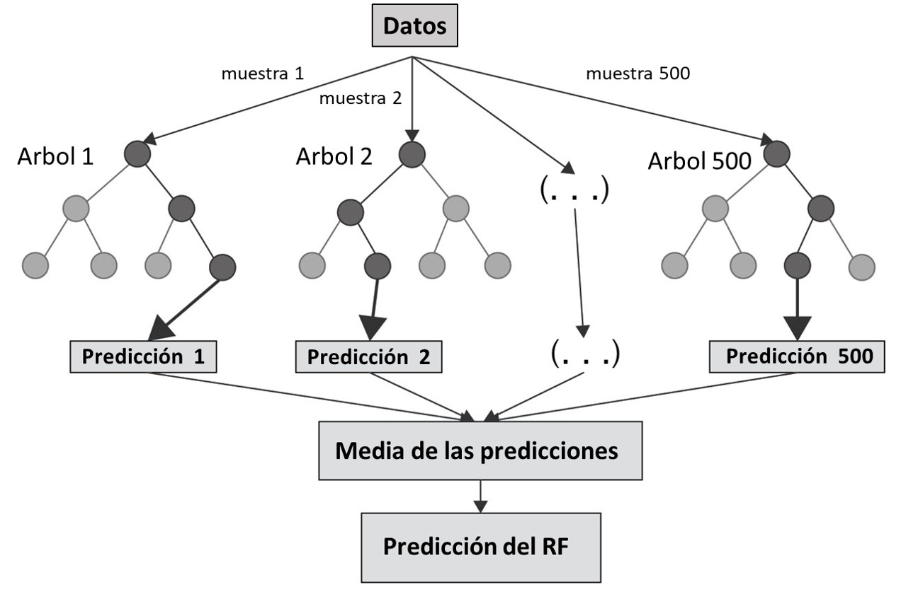

```{r setup, include=FALSE}
knitr::opts_chunk$set(echo = FALSE)
options(htmltools.dir.version=FALSE)
```

```{r, include=FALSE}
library(gstat) #
library(geoR) #
library(mapview) #
library(raster) #
library(leaflet) #
library(RColorBrewer) #
library(PerformanceAnalytics) #
library(ggplot2) #
library(caret) #
library(parallel) #

load(file = "Dia1.RData")
```

## Validación Cruzada

Estimar sucesivamente, mediante kriging, cada dato observado, considerando sólo los datos restantes.

Se calcula el error de estimación (diferencia entre el valor estimado y el valor verdadero) en cada sitio con dato.

Análisis estadístico de los errores cometidos en todos los sitios con datos.


- Validación cruzada k-fold 


```{r, echo=FALSE}

```

## Validación Cruzada

Medidas 

- Error medio
$$ME={\frac{1}{2}}\sum_{i=1}^{N}(z(x_0)-\hat Z(x_0))$$

- Error cuadrático medio

$$MSE= {\frac{1}{2}}\sum_{i=1}^{N}(z(x_0)-\hat Z(x_0))^2$$

- Raiz cuadrada del error cuadrático medio

$$RMSE= \sqrt{{\frac{1}{2}}\sum_{i=1}^{N}(z(x_0)-\hat Z(x_0))^2}$$

- Error cuadrático medio normalizado

Normalizado por la varianza kriging

$$ MSE= {\frac{1}{2}}\sum_{i=1}^{N}\frac{(z(x_0)-\hat Z(x_0))^2} {\hat\sigma^{2}(x_i)}$$

## Evaluación predictiva de los modelos
```{r, echo=TRUE, message=FALSE}
mod_exp
mod_esf

attr(mod_exp, 'SSErr')
attr(mod_esf, 'SSErr')

set.seed(17)
kricv_mod_esf <- krige.cv(VUT~1, datos, mod_esf, nfold=10)
set.seed(17)
kricv_mod_exp <- krige.cv(VUT~1, datos, mod_exp, nfold=10)

bubble(kricv_mod_esf, "residual", main = "Residuos Esferico") 
bubble(kricv_mod_exp, "residual", main = "Residuos Exponencial")

# Error medio de predicción (ME), cercano a cero mejor:
mean(kricv_mod_esf$residual)
mean(kricv_mod_exp$residual)

# Error medio absoluto (MAE)
mean(abs(kricv_mod_esf$residual))
mean(abs(kricv_mod_exp$residual))

# Error cuadratico medio de predicción (MSE), mas pequeño mejor
mean(kricv_mod_esf$residual^2)
mean(kricv_mod_exp$residual^2)

# Mean squared deviation ratio (MSDR), Error cuadratico medio normalizado, cercano a 1 mejor
mean(kricv_mod_esf$zscore^2)
mean(kricv_mod_exp$zscore^2)

# RMSE relativo a la media
sqrt(mean(kricv_mod_esf$residual^2))/mean(kricv_mod_esf$observed)*100
sqrt(mean(kricv_mod_exp$residual^2))/mean(kricv_mod_exp$observed)*100

# Correlación lineal entre valores observados y predichos
cor(kricv_mod_esf$observed, kricv_mod_esf$observed - kricv_mod_esf$residual)
cor(kricv_mod_exp$observed, kricv_mod_exp$observed - kricv_mod_exp$residual)

# Correlación lineal entre valores observados y predichos
par(mfrow=c(1,2))
plot(kricv_mod_esf$observed,kricv_mod_esf$observed - kricv_mod_esf$residual, xlab="Observados", ylab="Predichos")
plot(kricv_mod_exp$observed,kricv_mod_exp$observed - kricv_mod_exp$residual,xlab="Observados", ylab="Predichos")
```

## Kriging regresión
```{r, echo=FALSE, message=FALSE}
knitr::include_graphics("RK2.png")
```

## Kriging regresión

Paso 1, Ajustamos un modelo lineal múltiple
```{r, echo=TRUE, message=FALSE}
#1 Ajuste de modelo de RLM
mlr <- lm(VUT~g_porc_edi+ d_supcom + d_centro + d_indust + d_front , datos)
```

Paso 2, Kriging sobre los residuos
```{r, echo=TRUE, message=FALSE}
#Incorporamos los residuos del MLR a la base de datos
datos$residuos <-mlr$residuals
names(datos)

#Ajuste de semivariograma experimetal y teórico a los reiuduos
semiv_rk <- variogram(residuos~1 , datos)
plot(semiv_rk)

semiv_rk <- variogram(residuos~1 , datos, cutoff=2300)
plot(semiv_rk)

v.fit_vut_rk <- fit.variogram(semiv_rk ,vgm(c("Exp","Sph","Gau")))
plot(semiv_rk ,v.fit_vut_rk)

# Kriging sobre residuos
kgres <- krige(residuos~1, datos, ejes, model = v.fit_vut_rk)
spplot(kgres["var1.pred"], main = "Kriging Residual: Predicciones", col.regions=terrain.colors(20))
```

Paso 3, Predicción
```{r, echo=TRUE, message=FALSE}
#5 Predicción final
ejes$RK_pred <- predict(mlr, newdata=ejes) + kgres$var1.pred

spplot(ejes["RK_pred"], main = "Predicción RK", col.regions=terrain.colors(20))
```

Visualización RK
```{r, echo=TRUE, message=FALSE}
mapapred_ejesRK <- mapview(ejes, zcol = "RK_pred", ceX ="RK_pred",col.regions =  cols, layer.name ="Predicho Ejes RK", alpha=0)

muestra <- mapview(datos,zcol = "VUT", ceX ="VUT", layer.name ="Muestra", col.regions = cols, alpha=0)

mapapred_grilla <- mapview(pred_grilla,legend=T, col.regions =  cols, layer.name ="Predichos Grilla",na.color = "transparent")

mapapred_ejes <- mapview(kriging_ejes, zcol = "var1.pred", ceX ="var1.pred",col.regions =  cols, layer.name ="Predicho Ejes", alpha=0) 

muestra +  mapapred_grilla + mapapred_ejes + mapapred_ejesRK
```

## Árboles de Regresión

La regresión lineal genera modelos globales en los que una única función se aplica a todo el espacio muestral y puede emplearse con fines predictivos

Cuando el estudio implica múltiples predictores, que interaccionan entre ellos de forma compleja y no lineal los modelos de regresión lineal no son plausibles de emplearse

Los algoritmos basados en árboles engloban a un conjunto de técnicas supervisadas no paramétricas que consiguen segmentar el espacio de los predictores en regiones simples

## Árboles de Regresión

- Ventajas

Fáciles de interpretar aun cuando las relaciones entre predictores son complejas

Pueden utilizarse como regresoras tanto variables cuantitativas como cualitativas

No asume ningún tipo de supuesto distribucional

Permiten identificar las variables regresoras más importantes

Pueden usarse para la selección de variables predictoras

- Desventajas

Tendencia al overfitting, lo que afecta su capacidad predictiva

Puede verse afectado por la presencia de outliers 

Cuando tratan con variables continuas, pierden parte de su información al categorizarlas en el momento de la división de los nodos

## Árbol de Regresión

Variable respuesta cuantitativa

División sucesiva del espacio de los predictores generando regiones no solapadas (nodos terminales) $N_1, N_2, N_3, …, N_j$

La suma de cuadrados residual $SCR$ es el criterio por el cual se determina donde se introducen las divisiones, en que variables regresoras y en que valores de las mismas

$$SCR=\sum_{i=j}^{j}\sum_{ieR_j}(y_i-\hat y_{N_j})^2$$
siendo $\hat y_{N_j}$ la media de la variable respuesta en el nodo $j$

El proceso finaliza cuando:

Ningún nodo contenga un mínimo de n observaciones, 
El árbol tenga un máximo de nodos terminales 

La incorporación del nodo reduzca el error en al menos un % mínimo

## Métodos de ensamblaje

Los algoritmos de aprendizaje automático (machine learning, ML) se centran en la predicción del modelo, basándose en características conocidas y que son “aprendidas” a partir de datos (entrenamiento)

Los algoritmos de ensamblaje combinan predicciones de múltiples modelos en un único modelo para disminuir la varianza, sesgo o mejorar las predicciones

**Sesgo**, cuánto se alejan en promedio las predicciones de un modelo respecto a los valores reales

**Varianza**, cuánto varía el modelo dependiendo de la muestra empleada en el entrenamiento

**Sobreajuste**, el modelo se ajusta tanto a los datos de entrenamiento que es incapaz de predecir correctamente nuevas observaciones

El mejor modelo es aquel que consigue un equilibro óptimo entre sesgo y varianza


## Arbol de regresión

```{r, echo=FALSE,message=FALSE}
#knitr::include_graphics("CART2.jpg")
```

## Métodos de Ensamblaje

- Bagging: 

Se ajustan múltiples árboles en paralelo formando un “bosque”. 
En cada nueva predicción, todos los árboles que forman el “bosque” participan aportando su predicción. 

Como valor final, se toma la media de todas las predicciones (variables continuas) o la clase más frecuente (variables cualitativas). 

Ejemplo: Random Forest. 

- Boosting: 

Consiste en ajustar secuencialmente múltiples modelos sencillos, de manera que cada modelo aprende de los errores del anterior. 

Como valor final, se procede como el bagging 

Ejemplos: Boosted Regresión Tree

## Random Forest (RF)

El método de RF es una modificación del proceso de bagging que consigue mejores resultados gracias a que decorrelaciona los árboles generados en el proceso.

Hace una selección aleatoria de $m$ predictores antes de evaluar cada división
Si $m=p$ los resultados de RF y bagging son equivalentes

Valor recomendado del hiperparámetro es  $m= \sqrt p$ (clasificación) y $m=\frac {p}{3}$(regresión)

## RF regresión

```{r, echo=FALSE, fig.dim=0.2}
#
```

## RF Regresión
Paso 1, para ajustar el modelo RF debemos decidir el valor del parámetro "mtry"
```{r, echo=TRUE, message=FALSE}
datos <- read.table("datosSF_depurados.txt", header = T)

#Ajuste del RF con librería caret
seed <-7

# grilla de valores para mtry a evaluar
mtry <-expand.grid(mtry=seq(2,5,1)) 

#opciones de validación
fitControl <- trainControl(method = "cv",number=10, allowParallel = T)
```
Podemos paralelizar el proceso computacional 
```{r, echo=TRUE, message=FALSE}
# opciones para praralelizado 
# library(parallel)
# library(doParallel)
# cluster <- makeCluster(detectCores() - 1) 
# registerDoParallel(cluster)
```

Paso 2, ajustamos el modelo RF con "mtry" óptimo
```{r, echo=TRUE, message=FALSE}
#ajustamos el modelo de RF
set.seed(seed)
train_rf <- train(VUT ~ g_porc_edi + d_supcom + d_centro + d_indust + d_front, 
                  data=datos,
                  method = "rf",
                  importance=T,
                  tuneGrid =mtry,
                  trControl = fitControl)
```

Paso 3, Kriging sobre los residuos
```{r, echo=TRUE, message=FALSE}
#Incorporamos los residuos del MLR a la base de datos
datos$residuosRF <-datos$VUT - predict(train_rf, newdata=datos)

#Ajuste de semivariograma experimetal y teórico a los residuos del RF
coordinates(datos) <- c("x", "y")
crs(datos) <- CRS("+init=epsg:22174")

semiv_RFk <- variogram(residuosRF~1 , datos)
plot(semiv_RFk)

semiv_RFk <- variogram(residuosRF~1 , datos, cutoff=2300)
plot(semiv_RFk)

v.fit_vut_RFk <- fit.variogram(semiv_RFk ,vgm(c("Exp","Sph","Gau")))
plot(semiv_RFk ,v.fit_vut_RFk)

#Kriging sobre residuos del RF
kgresRF <- krige(residuosRF~1, datos, ejes, model = v.fit_vut_RFk)
spplot(kgresRF["var1.pred"], main = "Kriging Residual (RF): Predicciones", col.regions=terrain.colors(20))
```

Paso 4, predicción
```{r, echo=TRUE, message=FALSE}
#Predicción final RF
ejes$RFK_pred <- predict(train_rf, newdata=ejes) + kgresRF$var1.pred

spplot(ejes["RFK_pred"], main = "Predicción RFK", col.regions=terrain.colors(20))
```

Visualización predicción
```{r, echo=TRUE, message=FALSE}
mapapredejes_RFK <- mapview(ejes, zcol = "RFK_pred", ceX ="RFK_pred",col.regions =  cols, layer.name ="Predicho Ejes RFK", alpha=0)

muestra +  mapapred_grilla + mapapred_ejes +  mapapred_ejesRK + mapapredejes_RFK
```

## Evaluación y validación de modelos

Usamos la siguiente función
```{r, echo=TRUE, message=FALSE}
#Función validación
validacion <-function (fold, base, var.y) {
  require(caret)
  require(gstat)
  require(sp)

  datos <- read.table(base, head=T)
  names(datos)[names(datos) == var.y] <- 'Y'
 
  if (base=="petrel.txt") {
    names(datos)[names(datos) == 'long'] <- 'x'
    names(datos)[names(datos) == 'lat'] <- 'y'
    }
  
  seed <-7
  
  set.seed(seed) 
  datos$id <- sample(rep(1:10, nrow(datos), length.out = nrow(datos)))
  
  list <- 1:10
  prediccion <- data.frame()
  testset<- data.frame()
  
  training<- subset(datos, id %in% list[-fold]) 
  testing<- subset(datos, id %in% c(fold))
  
  # Kriging Ordinario 
  train_ko = training
  test_ko = testing
  coordinates(train_ko)<-~x+y
  coordinates(test_ko)<-~x+y
  vario <- variogram(Y ~1, train_ko)
  VF_vut_KO <- fit.variogram(vario, vgm(c("Sph", "Exp", "Gau"))) 
  KO <- krige(Y~ 1, train_ko, test_ko, VF_vut_KO, debug.level=0)
  
  # Regression Kriging  
  train_ko = training
  test_ko = testing
  
  coordinates(train_ko)<-~x+y
  coordinates(test_ko)<-~x+y
  
  mlr <- lm(Y ~. -x -y -id, training)
  
  pred_mlr = predict(mlr, newdata = test_ko)
  
  inside_rk <- predict(mlr, newdata=train_ko)
  train_ko$error_rk <- training$Y - inside_rk
  
  vario_rk <- variogram(error_rk~1, train_ko, cutoff=2300)
  model_rk_ko <- fit.variogram(vario_rk, vgm(c("Sph", "Exp", "Gau"))) 

  test_k <- krige(error_rk~ 1 , train_ko, test_ko, model_rk_ko, debug.level=0)
  test_rk_ko <- pred_mlr + test_k$var1.pred
  
  # Random Forest 
  #fitControl <- trainControl(method = "cv", number = 10)
  fitControl <- trainControl(method = "none")
  #mtry <-data.frame(mtry=2) 
  set.seed(seed)
  
  rf <- train(Y ~ . -x -y -id, data=training,
              method = "rf",
              #tuneGrid =mtry,
              trControl = fitControl,
              verbose = FALSE)

  test_rf <- predict(rf, newdata=testing)
  
  # Random Forest + Kriging Ordinario 
  inside_rf <- predict(rf, newdata=training)
  
  train_ko = training
  test_ko = testing
  
  coordinates(train_ko)<-~x+y
  coordinates(test_ko)<-~x+y
  
  train_ko$error_rf <- training$Y - inside_rf
  
  vario_rf <- variogram(error_rf~1, train_ko, cutoff=2300)
  
  model_rf_ko <- fit.variogram(vario_rf, vgm(c("Sph","Exp", "Gau"))) 
  
  test_ko <- krige(error_rf~ 1 , train_ko, test_ko, model_rf_ko, debug.level=0) 
  
  test_rf_ko <- test_rf + test_ko$var1.pred
  

  # Tabla observados y predichos
  testset <- rbind(testset, as.data.frame(testing[,"Y"]))
  result <- data.frame(data.frame("x"=testing$x,
                                  "y"=testing$y,
                                  "k-fold"=fold,
                                  "Observado"=testset[,1],
                                  "KO"=KO$var1.pred,
                                  "RK"=test_rk_ko,
                                  "RF"=test_rf,
                                  "RF_KO"=test_rf_ko))
  
  return(result)

}

# Para correr validacion cruzada con la función
#resultados <- do.call(rbind,lapply(1:10, validacion,base="meuse.txt", var.y="om"))

# correr validacion cruzada paralelizado
#num_cores <- detectCores()-1
#cl <- makeCluster(num_cores)
#system.time(resultados <-do.call(rbind,parLapply(cl, 1:10, validacion, #base="meuse.txt", var.y="om")))


# Función para comparación de métodos
#head(resultados)
#tabla <- resultados[,4:8]
resumen <- function (j) {
  ME <-mean(tabla [,j] - tabla[,"Observado"])
  MAE <- mean(abs(tabla [,j] - tabla[,"Observado"]))
  MAPE <- mean(abs(tabla [,j]-tabla[,"Observado"])/tabla[,"Observado"]) *100
  MSE <- mean((tabla [,j]-tabla[,"Observado"])^2)
  RMSE <-sqrt(mean((tabla [,j]-tabla[,"Observado"])^2))
  nRMSE <-sqrt(MSE)/mean(tabla[,"Observado"]) *100
  rLM <- lm(tabla [,j]~ tabla[,"Observado"])
  R2 <- as.matrix(summary(rLM)$adj.r.squared)
  resumen <- data.frame("Modelo"=names(tabla [j]),ME, MAE,MAPE, MSE, RMSE, nRMSE,R2)
  return(resumen) 
} 
# Ver resultados finales
#tablafinal <- do.call("rbind",lapply(2:5,resumen))  
#tablafinal
```

## Aplicaciones
Agricultura de precisión

Modelar rendimiento "RindeSoja"
```{r, echo=TRUE, message=FALSE, warning=FALSE}
resultadosAP <- do.call(rbind,lapply(1:10, validacion,base="datosAP.txt", var.y="RindeSoja"))
head(resultadosAP)

tabla <- resultadosAP[,4:8]

tablafinal_AP <- do.call("rbind",lapply(2:5,resumen)) 
tablafinal_AP
```

## Aplicaciones
Suelos Meuse 

Polución y calidad del suelo

Modelar "om" Materia Orgánica  
```{r, echo=TRUE, message=FALSE, warning=FALSE}
resultados_meuse <- do.call(rbind,lapply(1:10, validacion,base="meuse.txt", var.y="om"))
head(resultados_meuse)

tabla <- resultados_meuse[,4:8]

tablafinal_meuse <- do.call("rbind",lapply(2:5,resumen)) 
tablafinal_meuse
```

## Aplicaciones
Petrel "mud content"

Modelar "mud", contenido de lodo
```{r, echo=TRUE, message=FALSE, warning=FALSE}
# mud es asimetrica!!!
resultados_petrel <- do.call(rbind,lapply(1:10, validacion,base="petrel.txt", var.y="mud"))
head(resultados_petrel)

tabla <- resultados_petrel[,4:8]

tablafinal_petrel <- do.call("rbind",lapply(2:5,resumen)) 
tablafinal_petrel 
```

## Muchas Gracias

```{r, purl=FALSE}
knitr::include_graphics("http://giphygifs.s3.amazonaws.com/media/6fScAIQR0P0xW/giphy.gif")
```

<marianoacba@agro.unc.edu.ar>

<francagianninikurina@gmail.com>

Bibliografía
<https://drive.google.com/open?id=1yq7u3b2VrIoDD0z8kCztDvEpuW6mek59> 